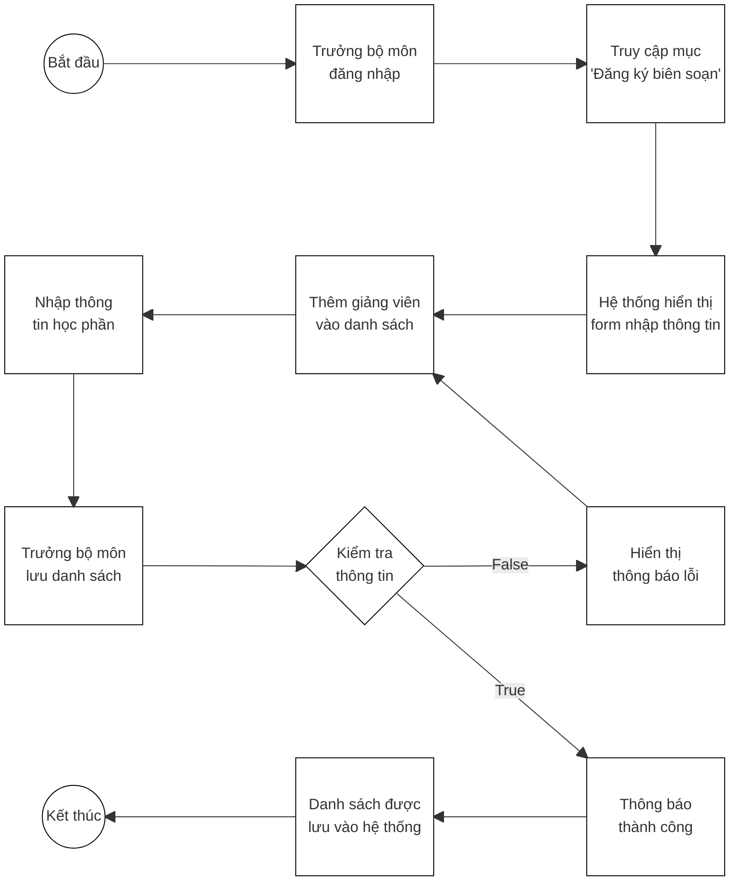

```mermaid

block-beta
    columns 5
    
    A(("Bắt đầu")) space B["Trưởng bộ môn\nđăng nhập"] space C["Truy cập mục \n'Đăng ký biên soạn'"]
    
    space:5
    
    F["Nhập thông\ntin học phần"] space E["Thêm giảng viên\nvào danh sách"] space D["Hệ thống hiển thị\nform nhập thông tin"]
    
    space:5
    
    G["Trưởng bộ môn\nlưu danh sách"] space H{"Kiểm tra\nthông tin"} space J["Hiển thị\nthông báo lỗi"] 
    
    space:5
    
    L(("Kết thúc")) space K["Danh sách được\nlưu vào hệ thống"] space I["Thông báo\nthành công"]
    
    A --> B
    B --> C
    C --> D
    D --> E
    E --> F
    F --> G
    G --> H
    H -- "True" --> I
    H -- "False" --> J
    J --> E
    I --> K
    K --> L

    classDef WHITE fill: #fff, stroke: #000
    class A,B,C,D,E,F,G,H,I,J,K,L WHITE
```