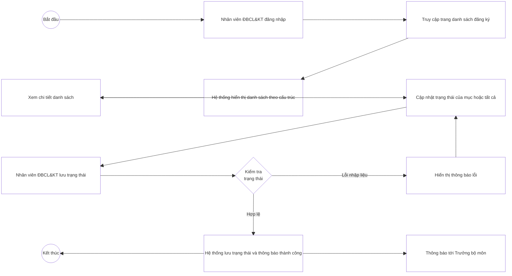

```mermaid
block-beta
    columns 5
    
    A(("Bắt đầu")) space B["Nhân viên ĐBCL&KT đăng nhập"] space C["Truy cập trang danh sách đăng ký"] 

    space space space space space
    
    F["Xem chi tiết danh sách"] space E["Hệ thống hiển thị danh sách theo cấu trúc"] space D["Cập nhật trạng thái của mục hoặc tất cả"]
    
    space space space space space
    
    G["Nhân viên ĐBCL&KT lưu trạng thái"] space H{"Kiểm tra\ntrạng thái"} space J["Hiển thị thông báo lỗi"] 
    
    space space space space space
    
    L(("Kết thúc")) space K["Hệ thống lưu trạng thái và thông báo thành công"]  space I["Thông báo tới Trưởng bộ môn"]  

    A --> B
    B --> C
    C --> E
    E --> F
    F --> D
    D --> G
    G --> H
    H -- "Hợp lệ" --> K
    H -- "Lỗi nhập liệu" --> J
    J --> D
    K --> I
    K --> L

    classDef WHITE fill:#fff
    class A,B,C,D,E,F,G,H,I,J,K,L,M,N,O,P,Q,R,S,T,U,V,W,X,Y,Z WHITE
``` 