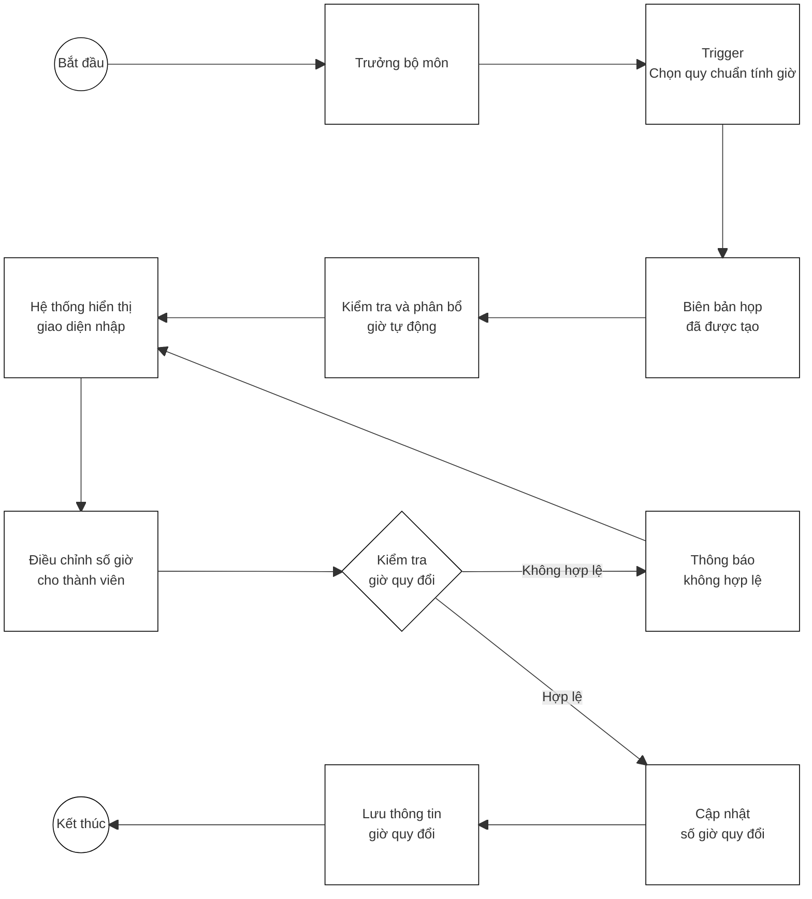

```mermaid
block-beta
    columns 5
    
    A(("Bắt đầu")) space B["Trưởng bộ môn"] space C["Trigger\nChọn quy chuẩn tính giờ"]
    
    space:5
    
    F["Hệ thống hiển thị\ngiao diện nhập"] space E["Kiểm tra và phân bổ\ngiờ tự động"] space D["Biên bản họp\nđã được tạo"]
    
    space:5
    
    G["Điều chỉnh số giờ\ncho thành viên"] space H{"Kiểm tra\ngiờ quy đổi"} space I["Thông báo\nkhông hợp lệ"]
    
    space:5
    
    L(("Kết thúc")) space K["Lưu thông tin\ngiờ quy đổi"] space J["Cập nhật\nsố giờ quy đổi"]
    
    A --> B
    B --> C
    C --> D
    D --> E
    E --> F
    F --> G
    G --> H
    H -- "Hợp lệ" --> J
    H -- "Không hợp lệ" --> I
    I --> F
    J --> K
    K --> L

    classDef WHITE fill: #fff, stroke: #000
    class A,B,C,D,E,F,G,H,I,J,K,L,M,N,O,P,Q,R,X,T,U,V,W,X,Y,Z WHITE
``` 