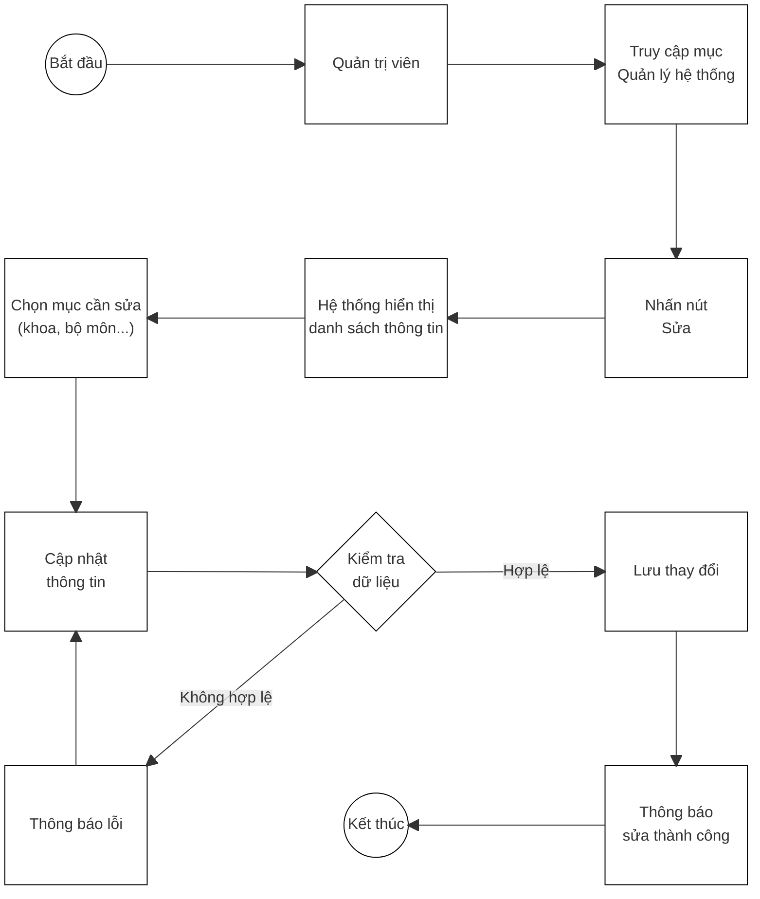

```mermaid
block-beta
    columns 5
    
    A(("Bắt đầu")) space B["Quản trị viên"] space C["Truy cập mục\nQuản lý hệ thống"]
    
    space:5
    
    F["Chọn mục cần sửa\n(khoa, bộ môn...)"] space E["Hệ thống hiển thị\ndanh sách thông tin"] space D["Nhấn nút\nSửa"]
    
    space:5
    
    G["Cập nhật\nthông tin"] space H{"Kiểm tra\ndữ liệu"} space J["Lưu thay đổi"] 
    
    space:5
    
    I["Thông báo lỗi"] space L(("Kết thúc")) space  K["Thông báo\nsửa thành công"] 
    
    A --> B
    B --> C
    C --> D
    D --> E
    E --> F
    F --> G
    G --> H
    H -- "Hợp lệ" --> J
    H -- "Không hợp lệ" --> I
    I --> G
    J --> K
    K --> L

    classDef WHITE fill: #fff, stroke: #000
    class A,B,C,D,E,F,G,H,I,J,K,L,M,N,O,P,Q,R,X,T,U,V,W,X,Y,Z WHITE
``` 