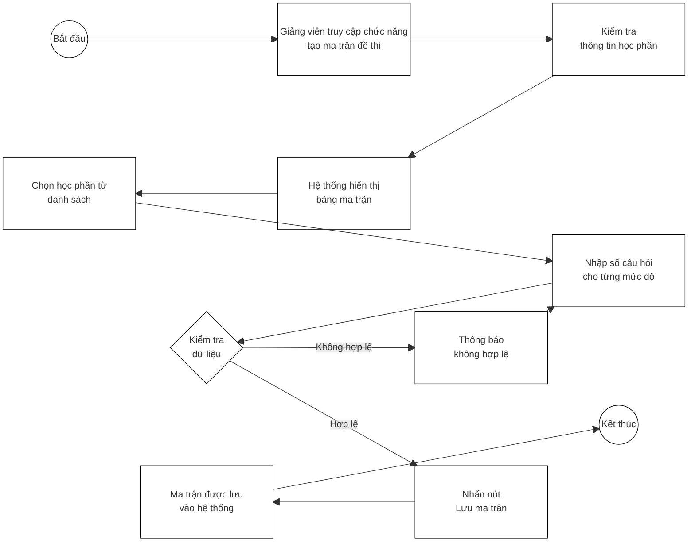

```mermaid
block-beta
    columns 5
    
    A(("Bắt đầu")) space C["Giảng viên truy cập chức năng\ntạo ma trận đề thi"] space D["Kiểm tra\nthông tin học phần"]
    
    space:5
    
    F["Chọn học phần từ\ndanh sách"] space E["Hệ thống hiển thị\nbảng ma trận"] space 
    
    space:5
    
    G["Nhập số câu hỏi\ncho từng mức độ"] space H{"Kiểm tra\ndữ liệu"} space I["Thông báo\nkhông hợp lệ"]
    
    space:5
    
    L(("Kết thúc")) space K["Ma trận được lưu\nvào hệ thống"] space J["Nhấn nút\nLưu ma trận"]
    
    A --> C
    C --> D
    D --> E
    E --> F
    F --> G
    G --> H
    H -- "Hợp lệ" --> J
    H -- "Không hợp lệ" --> I
    I --> G
    J --> K
    K --> L

    classDef WHITE fill: #fff, stroke: #000
    class A,B,C,D,E,F,G,H,I,J,K,L,M,N,O,P,Q,R,X,T,U,V,W,X,Y,Z WHITE
``` 