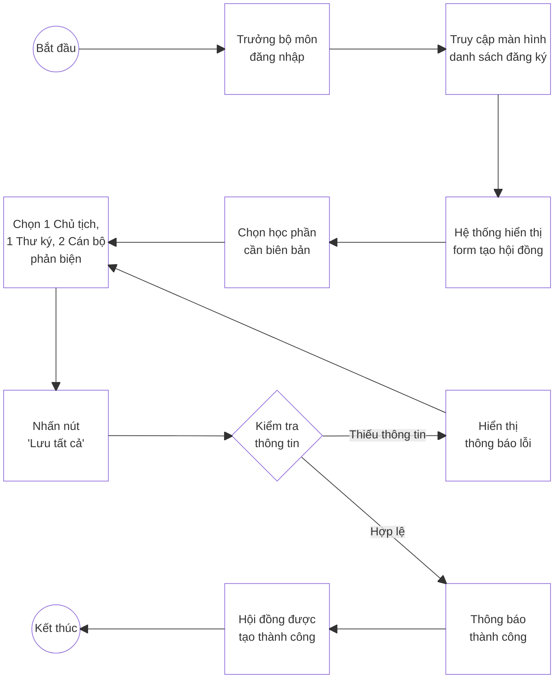

```mermaid
block-beta
    columns 5
    
    A(("Bắt đầu")) space B["Trưởng bộ môn\nđăng nhập"] space C["Truy cập màn hình\ndanh sách đăng ký"]
    
    space:5
    
    F["Chọn 1 Chủ tịch,\n1 Thư ký, 2 Cán bộ\nphản biện"] space E["Chọn học phần\ncần biên bản"] space D["Hệ thống hiển thị\nform tạo hội đồng"]
    
    space:5
    
    G["Nhấn nút\n'Lưu tất cả'"] space H{"Kiểm tra\nthông tin"} space J["Hiển thị\nthông báo lỗi"] 
    
    space:5
    
    L(("Kết thúc")) space K["Hội đồng được\ntạo thành công"] space I["Thông báo\nthành công"]
    
    A --> B
    B --> C
    C --> D
    D --> E
    E --> F
    F --> G
    G --> H
    H -- "Hợp lệ" --> I
    H -- "Thiếu thông tin" --> J
    J --> F
    I --> K
    K --> L

    classDef WHITE fill: #fff
    class A,B,C,D,E,F,G,H,I,J,K,L,M,N,O,P,Q,R,X,T,U,V,W,X,Y,Z WHITE
``` 