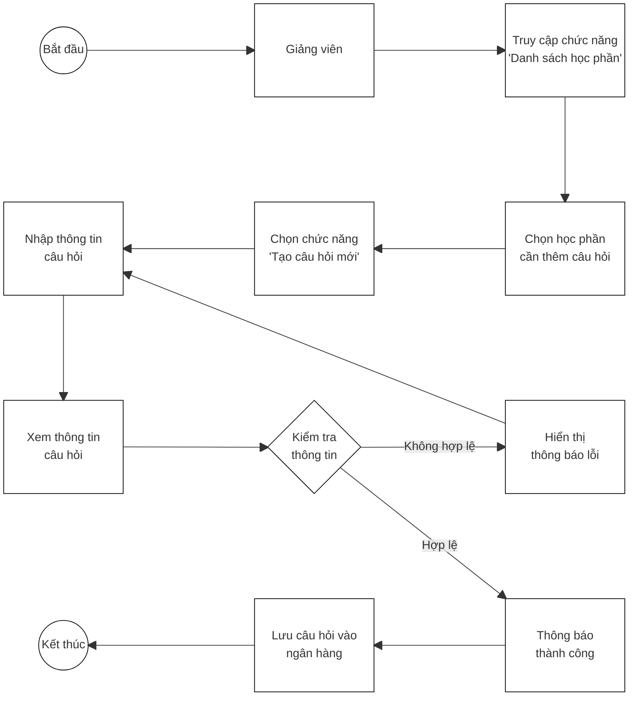

```mermaid
block-beta
    columns 5

    A(("Bắt đầu")) space B["Giảng viên"] space C["Truy cập chức năng\n'Danh sách học phần'"]
    
    space:5
    
    F["Nhập thông tin\ncâu hỏi"] space E["Chọn chức năng\n'Tạo câu hỏi mới'"] space D["Chọn học phần\ncần thêm câu hỏi"]
    
    space:5
    
    G["Xem thông tin\ncâu hỏi"] space H{"Kiểm tra\nthông tin"} space J["Hiển thị\nthông báo lỗi"]
    
    space:5
    
    L(("Kết thúc")) space K["Lưu câu hỏi vào\nngân hàng"] space I["Thông báo\nthành công"]

    A --> B
    B --> C
    C --> D
    D --> E
    E --> F
    F --> G
    G --> H
    H -- "Hợp lệ" --> I
    H -- "Không hợp lệ" --> J
    J --> F
    I --> K
    K --> L

    classDef WHITE fill: #fff, stroke: #000
    class A,B,C,D,E,F,G,H,I,J,K,L,M,N,O,P,Q,R,X,T,U,V,W,X,Y,Z WHITE
``` 