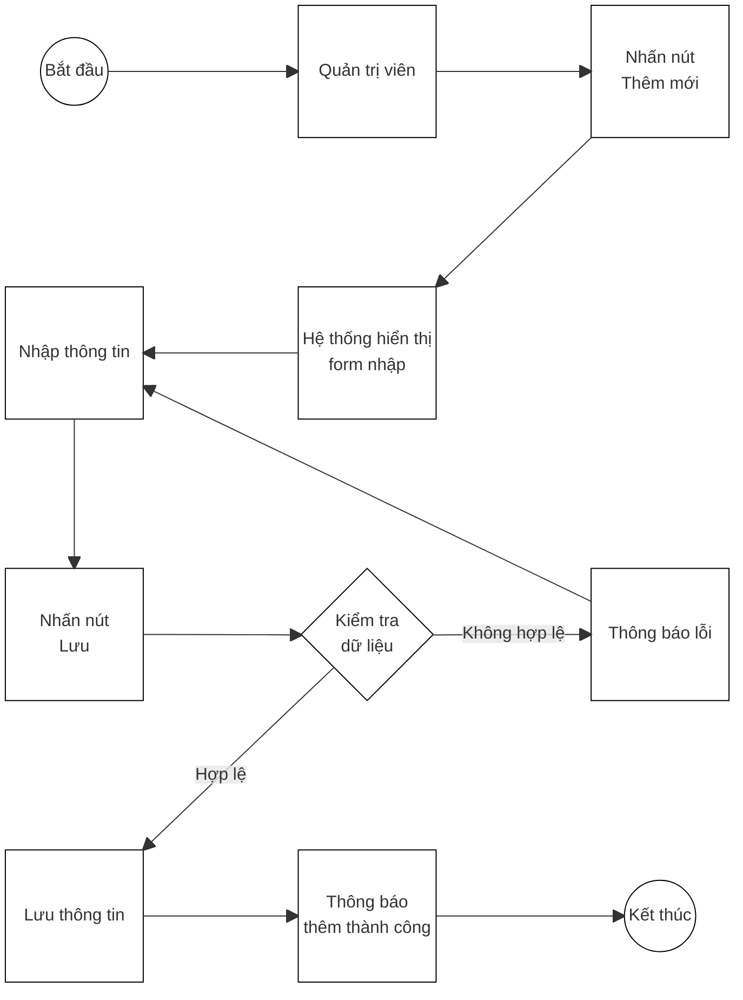

```mermaid
block-beta
    columns 5
    
    A(("Bắt đầu")) space B["Quản trị viên"] space C["Nhấn nút\nThêm mới"]
    
    space:5
    
    F["Nhập thông tin"] space E["Hệ thống hiển thị\nform nhập"] space space
    
    space:5
    
    G["Nhấn nút\nLưu"] space H{"Kiểm tra\ndữ liệu"} space I["Thông báo lỗi"]
    
    space:5
    
    J["Lưu thông tin"] space K["Thông báo\nthêm thành công"] space L(("Kết thúc"))
    
    A --> B
    B --> C
    C --> E
    E --> F
    F --> G
    G --> H
    H -- "Hợp lệ" --> J
    H -- "Không hợp lệ" --> I
    I --> F
    J --> K
    K --> L

    classDef WHITE fill: #fff, stroke: #000
    class A,B,C,D,E,F,G,H,I,J,K,L,M,N,O,P,Q,R,X,T,U,V,W,X,Y,Z WHITE
``` 