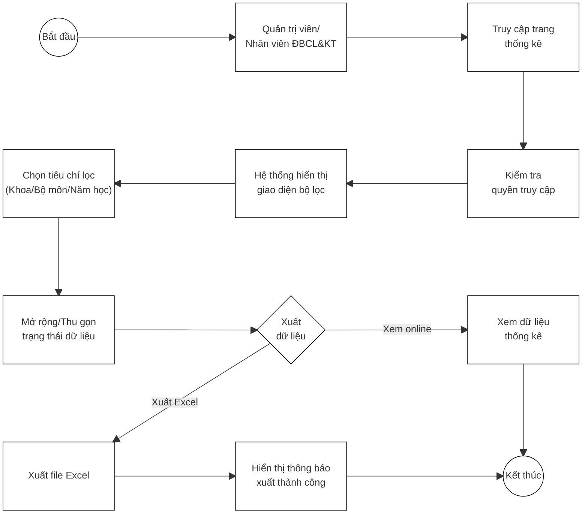

```mermaid
block-beta
    columns 5
    
    A(("Bắt đầu")) space B["Quản trị viên/\nNhân viên ĐBCL&KT"] space C["Truy cập trang\nthống kê"]
    
    space:5
    
    F["Chọn tiêu chí lọc\n(Khoa/Bộ môn/Năm học)"] space E["Hệ thống hiển thị\ngiao diện bộ lọc"] space D["Kiểm tra\nquyền truy cập"]
    
    space:5
    
    G["Mở rộng/Thu gọn\ntrạng thái dữ liệu"] space H{"Xuất\ndữ liệu"} space J["Xem dữ liệu\nthống kê"] 
    
    space:5
    
    I["Xuất file Excel"] space K["Hiển thị thông báo\nxuất thành công"] space L(("Kết thúc")) 
    
    A --> B
    B --> C
    C --> D
    D --> E
    E --> F
    F --> G
    G --> H
    H -- "Xuất Excel" --> I
    H -- "Xem online" --> J
    I --> K
    J --> L
    K --> L

    classDef WHITE fill: #fff, stroke: #000
    class A,B,C,D,E,F,G,H,I,J,K,L,M,N,O,P,Q,R,X,T,U,V,W,X,Y,Z WHITE
``` 