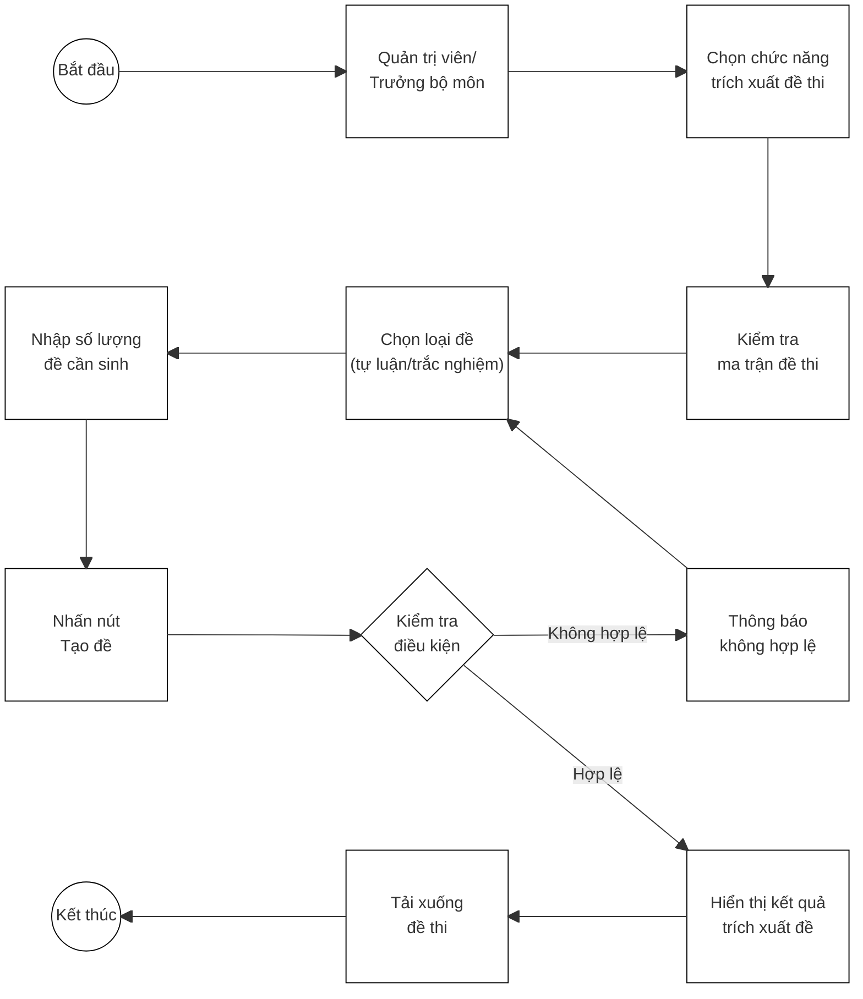

```mermaid
block-beta
    columns 5
    
    A(("Bắt đầu")) space B["Quản trị viên/\nTrưởng bộ môn"] space C["Chọn chức năng\ntrích xuất đề thi"]
    
    space:5
    
    F["Nhập số lượng\nđề cần sinh"] space E["Chọn loại đề\n(tự luận/trắc nghiệm)"] space D["Kiểm tra\nma trận đề thi"]
    
    space:5
    
    G["Nhấn nút\nTạo đề"] space H{"Kiểm tra\nđiều kiện"} space I["Thông báo\nkhông hợp lệ"]
    
    space:5
    
    L(("Kết thúc")) space K["Tải xuống\nđề thi"] space J["Hiển thị kết quả\ntrích xuất đề"]
    
    A --> B
    B --> C
    C --> D
    D --> E
    E --> F
    F --> G
    G --> H
    H -- "Hợp lệ" --> J
    H -- "Không hợp lệ" --> I
    I --> E
    J --> K
    K --> L

    classDef WHITE fill: #fff, stroke: #000
    class A,B,C,D,E,F,G,H,I,J,K,L,M,N,O,P,Q,R,X,T,U,V,W,X,Y,Z WHITE
``` 