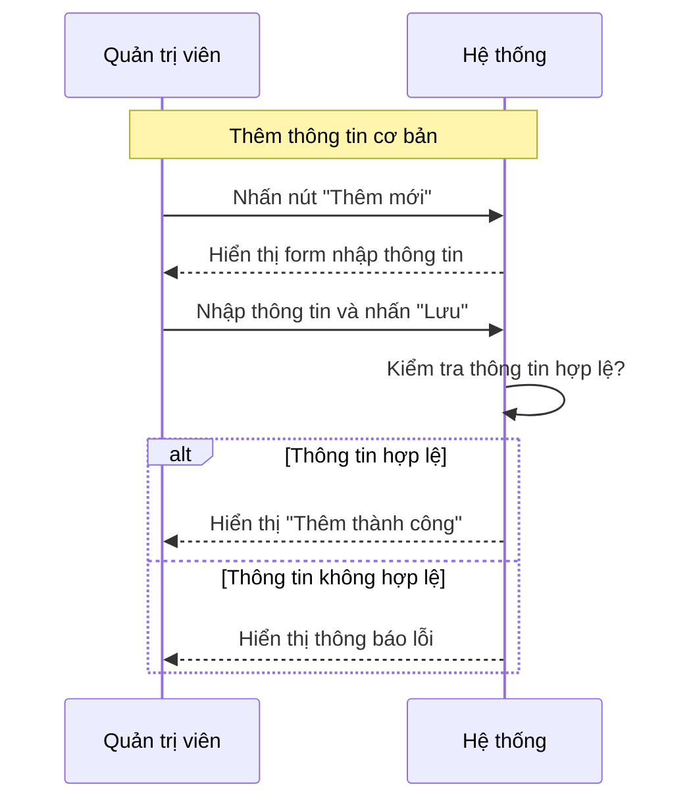

```mermaid
sequenceDiagram
    participant Admin as Quản trị viên
    participant System as Hệ thống

    Note over Admin,System: Thêm thông tin cơ bản

    Admin->>System: Nhấn nút "Thêm mới"
    System-->>Admin: Hiển thị form nhập thông tin

    Admin->>System: Nhập thông tin và nhấn "Lưu"
    System->>System: Kiểm tra thông tin hợp lệ?
    alt Thông tin hợp lệ
        System-->>Admin: Hiển thị "Thêm thành công"
    else Thông tin không hợp lệ
        System-->>Admin: Hiển thị thông báo lỗi
    end
```