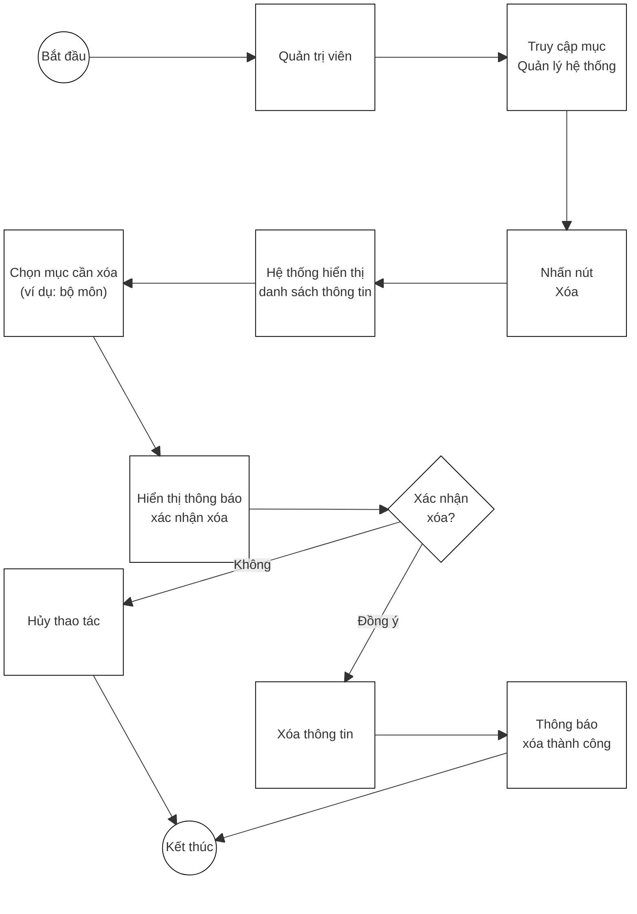

```mermaid
block-beta
    columns 5
    
    A(("Bắt đầu")) space B["Quản trị viên"] space C["Truy cập mục\nQuản lý hệ thống"]
    
    space:5
    
    F["Chọn mục cần xóa\n(ví dụ: bộ môn)"] space E["Hệ thống hiển thị\ndanh sách thông tin"] space D["Nhấn nút\nXóa"]
    
    space:5
    
    space G["Hiển thị thông báo\nxác nhận xóa"] space H{"Xác nhận\nxóa?"} space I["Hủy thao tác"]
    
    space:5
    
    space J["Xóa thông tin"] space K["Thông báo\nxóa thành công"] space L(("Kết thúc"))
    
    A --> B
    B --> C
    C --> D
    D --> E
    E --> F
    F --> G
    G --> H
    H -- "Đồng ý" --> J
    H -- "Không" --> I
    I --> L
    J --> K
    K --> L

    classDef WHITE fill: #fff, stroke: #000
    class A,B,C,D,E,F,G,H,I,J,K,L,M,N,O,P,Q,R,X,T,U,V,W,X,Y,Z WHITE
``` 