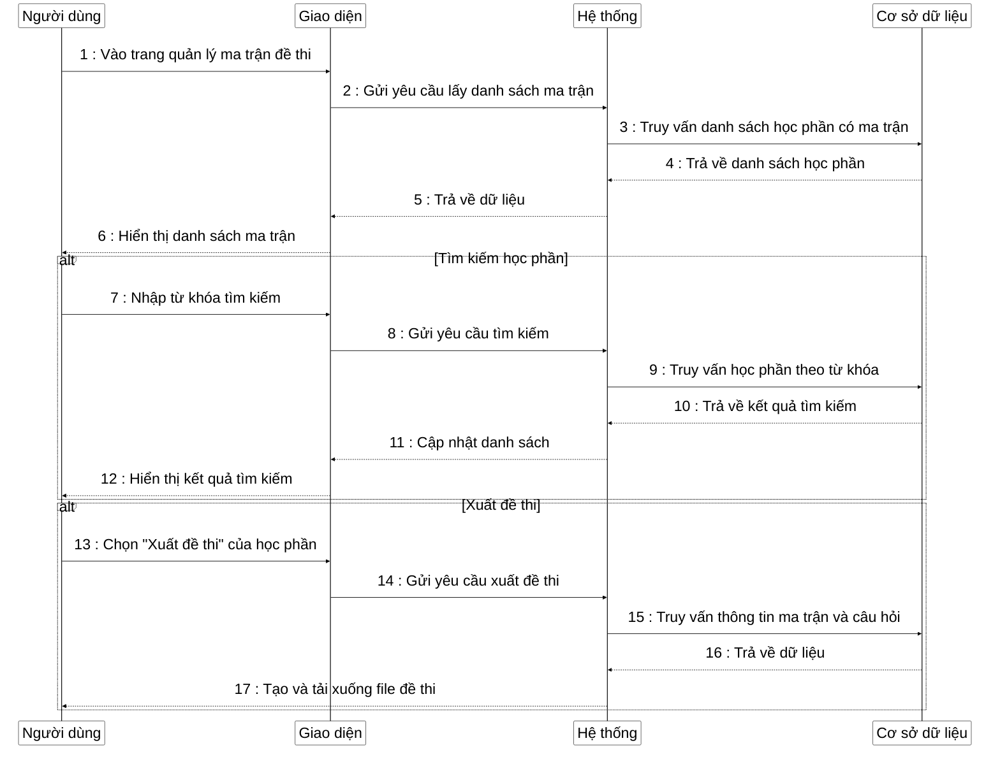

**Mô tả**: Sơ đồ tuần tự mô tả quy trình quản lý ma trận đề thi trong hệ thống ngân hàng câu hỏi. Quá trình bắt đầu khi người dùng truy cập trang quản lý ma trận đề thi, hệ thống sẽ hiển thị danh sách các học phần đã có ma trận đề thi. Người dùng có thể tìm kiếm học phần theo tên hoặc mã học phần, hệ thống sẽ truy vấn cơ sở dữ liệu và hiển thị kết quả tìm kiếm. Ngoài ra, người dùng có thể chọn chức năng xuất đề thi cho một học phần cụ thể, hệ thống sẽ tạo đề thi dựa trên ma trận và ngân hàng câu hỏi, sau đó cung cấp file đề thi để người dùng tải xuống. 