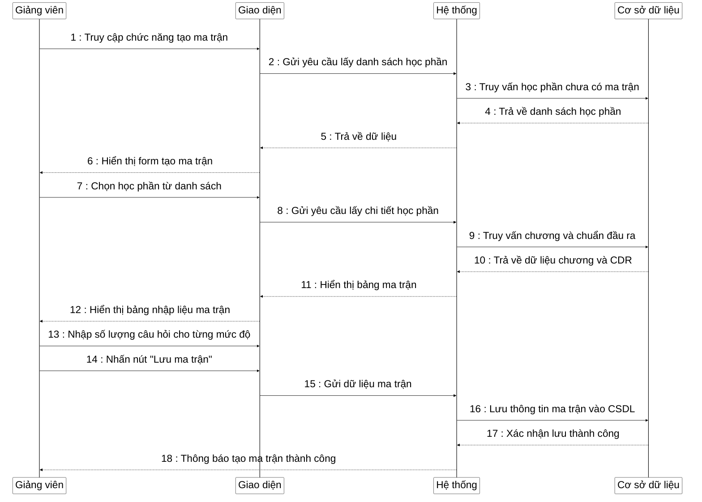

**Mô tả**: Sơ đồ tuần tự mô tả quy trình tạo ma trận đề thi trong hệ thống ngân hàng câu hỏi. Quá trình bắt đầu khi giảng viên truy cập chức năng tạo ma trận đề thi. Hệ thống hiển thị form với danh sách các học phần chưa có ma trận. Giảng viên chọn một học phần, hệ thống sẽ tải dữ liệu về các chương và chuẩn đầu ra của học phần đó, hiển thị bảng ma trận để giảng viên nhập số lượng câu hỏi cho từng chương, chuẩn đầu ra và mức độ (Dễ, Trung bình, Khó). Sau khi giảng viên nhập đủ thông tin và nhấn nút "Lưu ma trận", hệ thống sẽ kiểm tra tính hợp lệ của dữ liệu rồi lưu ma trận vào cơ sở dữ liệu. Khi lưu thành công, hệ thống sẽ hiển thị thông báo xác nhận. 