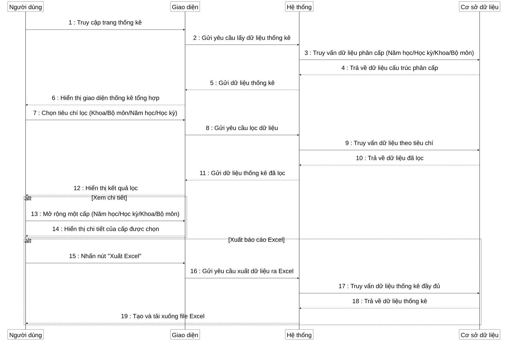

**Mô tả**: Sơ đồ tuần tự mô tả quy trình thống kê danh sách đăng ký biên soạn trong hệ thống ngân hàng câu hỏi. Quá trình bắt đầu khi người dùng (quản trị viên hoặc nhân viên ĐBCL&KT) truy cập trang thống kê. Hệ thống hiển thị giao diện thống kê với cấu trúc phân cấp theo năm học, học kỳ, khoa và bộ môn. Người dùng có thể áp dụng các bộ lọc (chọn khoa, bộ môn, năm học, học kỳ) để xem dữ liệu thống kê theo yêu cầu. Khi áp dụng bộ lọc, hệ thống sẽ truy vấn lại cơ sở dữ liệu và hiển thị kết quả đã lọc. Người dùng cũng có thể mở rộng từng cấp trong cấu trúc phân cấp để xem chi tiết. Ngoài ra, hệ thống còn cung cấp chức năng xuất dữ liệu thống kê ra file Excel để người dùng có thể tải xuống và sử dụng cho các mục đích khác. 