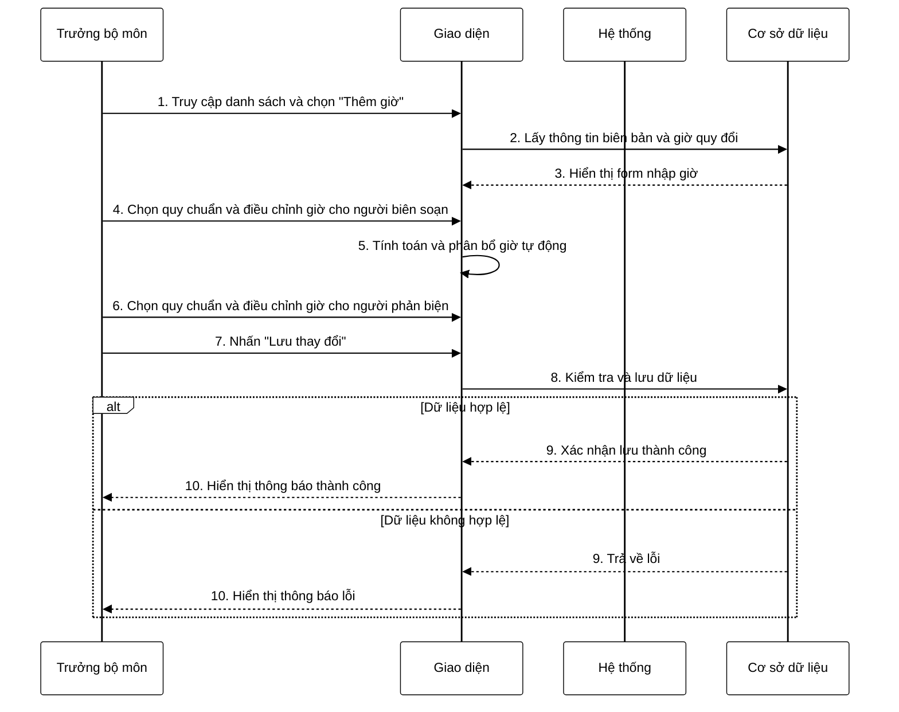

**Mô tả:** Trưởng bộ môn truy cập vào danh sách biên bản họp đã được tạo và chọn chức năng "Thêm giờ" cho một biên bản cụ thể. Hệ thống hiển thị form với thông tin chi tiết của biên bản và cho phép trưởng bộ môn chọn quy chuẩn tính giờ cho người biên soạn và người phản biện từ danh sách quy đổi có sẵn. Khi trưởng bộ môn chọn quy chuẩn, hệ thống tự động tính toán và phân bổ giờ cho từng giảng viên biên soạn và thành viên hội đồng. Trưởng bộ môn có thể điều chỉnh số giờ cho từng cá nhân nếu cần thiết, tuy nhiên tổng số giờ phải phù hợp với quy chuẩn đã chọn. Khi hoàn tất, trưởng bộ môn nhấn nút "Lưu thay đổi" để cập nhật thông tin. Hệ thống kiểm tra tính hợp lệ của dữ liệu (tổng số giờ phải khớp với quy định theo quy chuẩn) và lưu thông tin vào cơ sở dữ liệu nếu hợp lệ. Nếu dữ liệu không hợp lệ, hệ thống sẽ hiển thị thông báo lỗi tương ứng. 