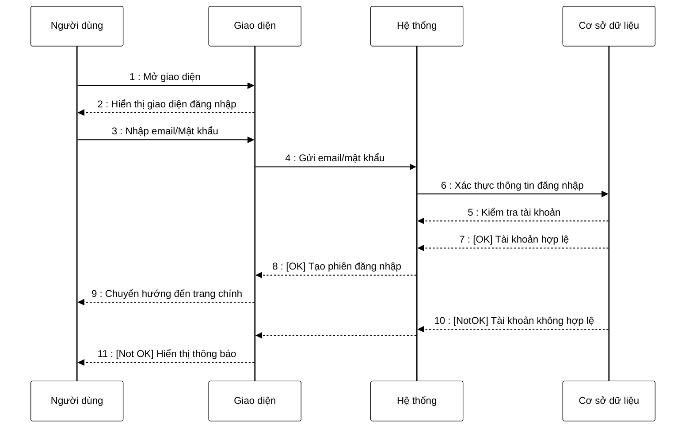

**Mô tả**: Người dùng mở giao diện ứng dụng và nhập email, password để đăng nhập vào hệ thống. Thông tin đăng nhập được gửi đến hệ thống. Hệ thống truy xuất cơ sở dữ liệu, kiểm tra thông tin đăng nhập. Nếu tài khoản hợp lệ, khớp với dữ liệu có trong cơ sở dữ liệu thì tạo mới phiên hoạt động cho người dùng và chuyển người dùng về trang chủ. Hoặc nếu tài khoản không hợp lệ (không có bản ghi tương ứng trong cơ sở dữ liệu) thì hiển thị thông báo đăng nhập không thành công.
