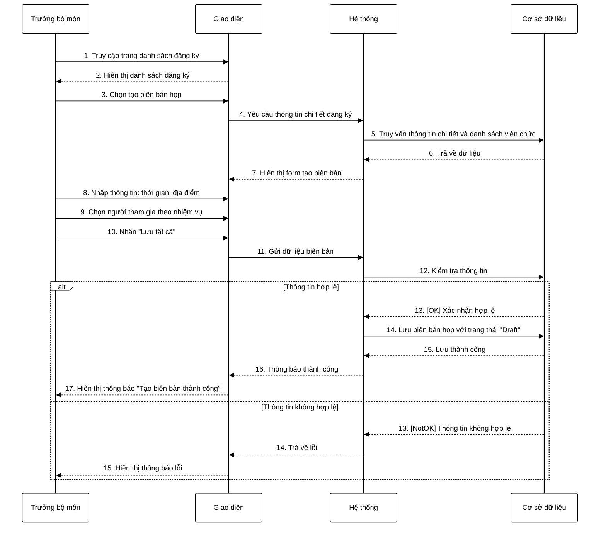

**Mô tả:** Trưởng bộ môn truy cập trang danh sách đăng ký và chọn chức năng tạo biên bản họp. Hệ thống truy vấn thông tin chi tiết đăng ký, danh sách viên chức và nhiệm vụ từ cơ sở dữ liệu. Giao diện hiển thị form tạo biên bản với thông tin chi tiết đăng ký đã được chọn. Trưởng bộ môn nhập các thông tin cần thiết như thời gian, địa điểm và chọn các thành viên tham gia theo nhiệm vụ (Chủ tịch, Thư ký, Cán bộ phản biện, Ủy viên). Khi hoàn tất, trưởng bộ môn nhấn nút "Lưu tất cả". Hệ thống kiểm tra tính hợp lệ của dữ liệu. Nếu thông tin hợp lệ, hệ thống lưu biên bản họp với trạng thái "Draft" và hiển thị thông báo thành công. Ngược lại, nếu thông tin không hợp lệ (thiếu trường bắt buộc, định dạng sai, v.v.), hệ thống sẽ hiển thị thông báo lỗi tương ứng. 