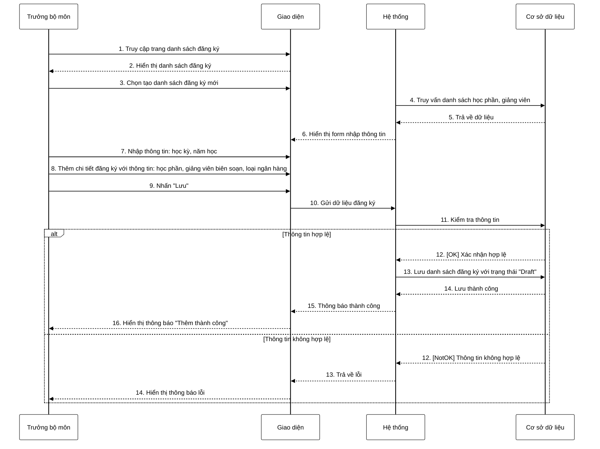

**Mô tả:** Trưởng bộ môn truy cập trang danh sách đăng ký và chọn tạo danh sách đăng ký mới. Hệ thống truy vấn và hiển thị thông tin cần thiết để tạo đăng ký như danh sách học phần, giảng viên. Trưởng bộ môn nhập các thông tin cơ bản: học kỳ, năm học, sau đó thêm chi tiết đăng ký gồm học phần, giảng viên biên soạn, loại ngân hàng (câu hỏi hoặc đề thi) và các thông tin khác như số lượng, hình thức thi. Khi hoàn thành, trưởng bộ môn nhấn nút "Lưu". Hệ thống kiểm tra tính hợp lệ của dữ liệu. Nếu thông tin hợp lệ, hệ thống lưu danh sách đăng ký với trạng thái "Draft" và hiển thị thông báo thành công. Ngược lại, nếu thông tin không hợp lệ (thiếu trường bắt buộc, định dạng sai, v.v.), hệ thống sẽ hiển thị thông báo lỗi tương ứng. 