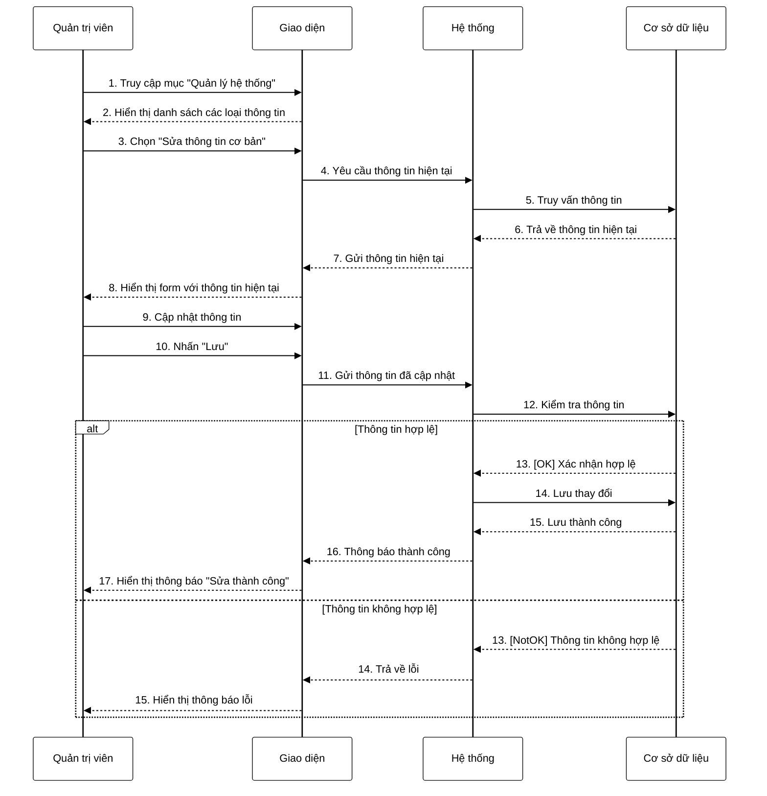

**Mô tả:** Quản trị viên truy cập mục "Quản lý hệ thống", hệ thống hiển thị danh sách các loại thông tin. Quản trị viên chọn tính năng "Sửa thông tin cơ bản". Hệ thống truy vấn thông tin hiện tại từ cơ sở dữ liệu và hiển thị form với dữ liệu đã được điền sẵn. Quản trị viên cập nhật thông tin cần sửa và nhấn nút "Lưu". Hệ thống kiểm tra tính hợp lệ của dữ liệu. Nếu thông tin hợp lệ, hệ thống lưu thay đổi vào cơ sở dữ liệu và hiển thị thông báo thành công. Ngược lại, nếu thông tin không hợp lệ (thiếu trường bắt buộc, định dạng sai, v.v.), hệ thống sẽ hiển thị thông báo lỗi tương ứng. 