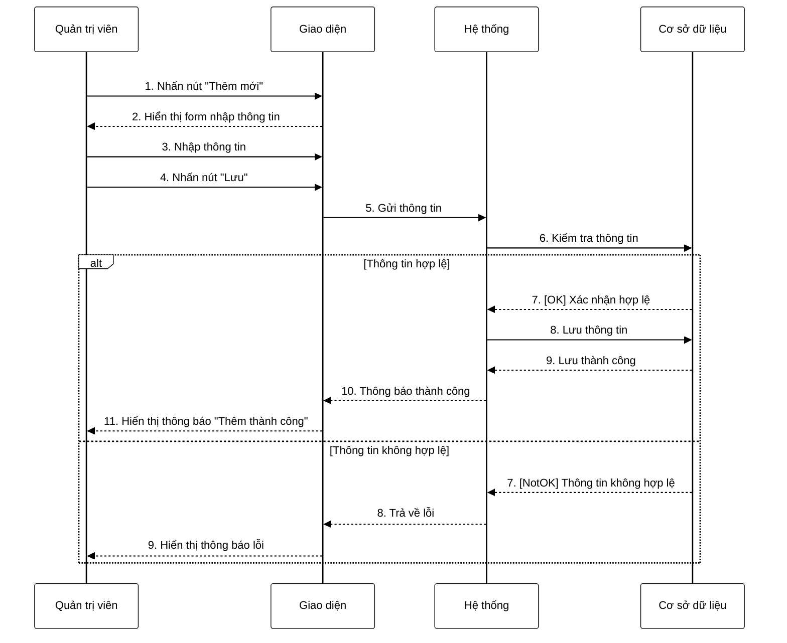

**Mô tả:** Quản trị viên nhấn nút "Thêm mới" trên giao diện để thêm một danh mục mới vào hệ thống. Giao diện hiển thị form nhập thông tin. Quản trị viên nhập các thông tin cần thiết và nhấn nút "Lưu". Hệ thống tiếp nhận thông tin và kiểm tra tính hợp lệ của dữ liệu trong cơ sở dữ liệu. Nếu thông tin hợp lệ, hệ thống sẽ lưu thông tin vào cơ sở dữ liệu và hiển thị thông báo thành công. Ngược lại, nếu thông tin không hợp lệ (thiếu trường bắt buộc, mã trùng lặp, v.v.), hệ thống sẽ hiển thị thông báo lỗi tương ứng. 