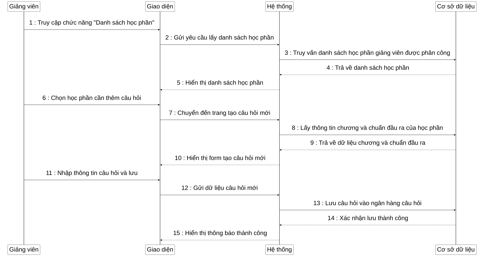

**Mô tả**: Sơ đồ tuần tự mô tả quy trình giảng viên thêm câu hỏi bổ sung vào ngân hàng câu hỏi thi. Đầu tiên, giảng viên truy cập vào chức năng "Danh sách học phần" để xem các học phần được phân công. Hệ thống truy vấn cơ sở dữ liệu và hiển thị danh sách học phần. Giảng viên chọn học phần cần thêm câu hỏi, hệ thống chuyển đến trang tạo câu hỏi mới và lấy thông tin về các chương và chuẩn đầu ra của học phần đó. Sau khi form tạo câu hỏi được hiển thị, giảng viên nhập thông tin câu hỏi bao gồm nội dung, đáp án, điểm số, mức độ, chương và chuẩn đầu ra. Cuối cùng, hệ thống lưu câu hỏi vào cơ sở dữ liệu và hiển thị thông báo thành công. 