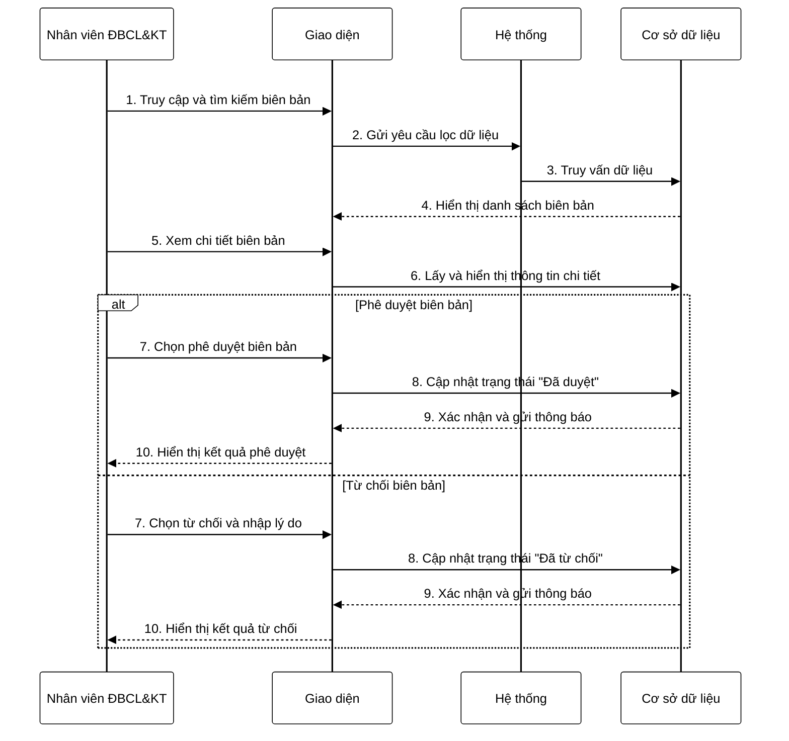

**Mô tả:** Nhân viên Phòng Đảm bảo chất lượng & Khảo thí truy cập vào danh sách biên bản nghiệm thu. Hệ thống hiển thị danh sách các biên bản được tổ chức theo năm học, học kỳ, khoa và bộ môn. Nhân viên có thể sử dụng bộ lọc để tìm kiếm biên bản cụ thể theo nhiều tiêu chí. Sau khi tìm thấy biên bản cần xem xét, nhân viên nhấn vào nút xem chi tiết để xem thông tin đầy đủ về biên bản nghiệm thu. Sau khi xem xét nội dung biên bản, nhân viên quyết định phê duyệt hoặc từ chối. Nếu phê duyệt, hệ thống cập nhật trạng thái biên bản thành "Đã duyệt" và gửi email thông báo đến Trưởng bộ môn. Nếu từ chối, nhân viên phải nhập lý do từ chối, sau đó hệ thống cập nhật trạng thái biên bản thành "Đã từ chối" và gửi email kèm lý do từ chối đến Trưởng bộ môn. 