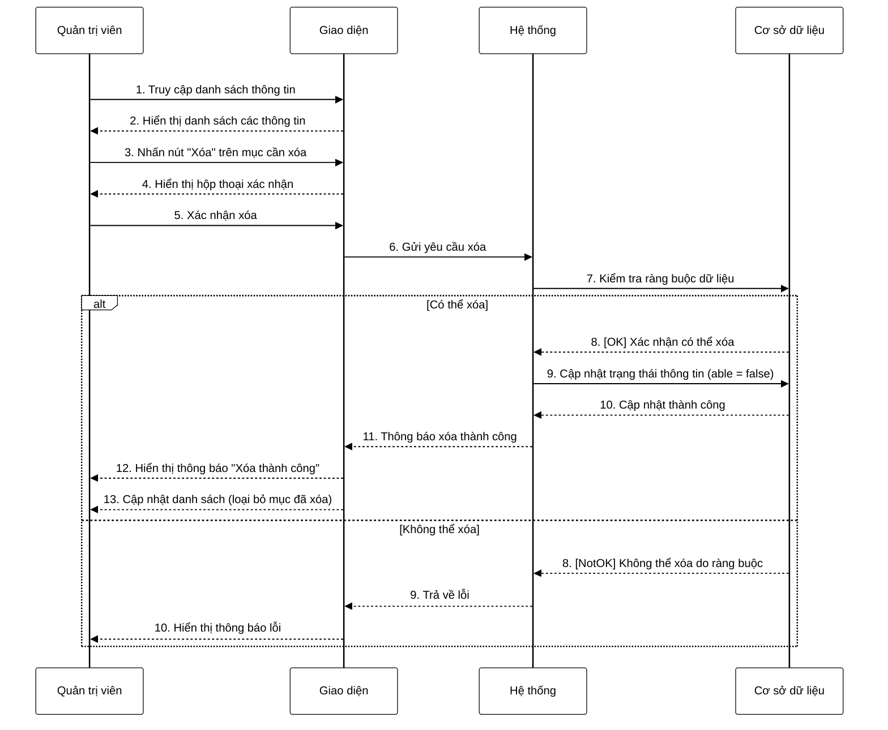

**Mô tả:** Quản trị viên truy cập danh sách thông tin cần quản lý. Hệ thống hiển thị danh sách các thông tin hiện có. Quản trị viên nhấn nút "Xóa" trên mục cần xóa. Hệ thống hiển thị hộp thoại xác nhận để tránh xóa nhầm. Sau khi quản trị viên xác nhận, hệ thống gửi yêu cầu xóa và kiểm tra các ràng buộc dữ liệu. Nếu thông tin có thể xóa (không có ràng buộc với dữ liệu khác), hệ thống sẽ cập nhật trạng thái của thông tin (đánh dấu là đã xóa thay vì xóa hoàn toàn) và hiển thị thông báo thành công. Ngược lại, nếu thông tin không thể xóa do ràng buộc với dữ liệu khác, hệ thống sẽ hiển thị thông báo lỗi tương ứng. 