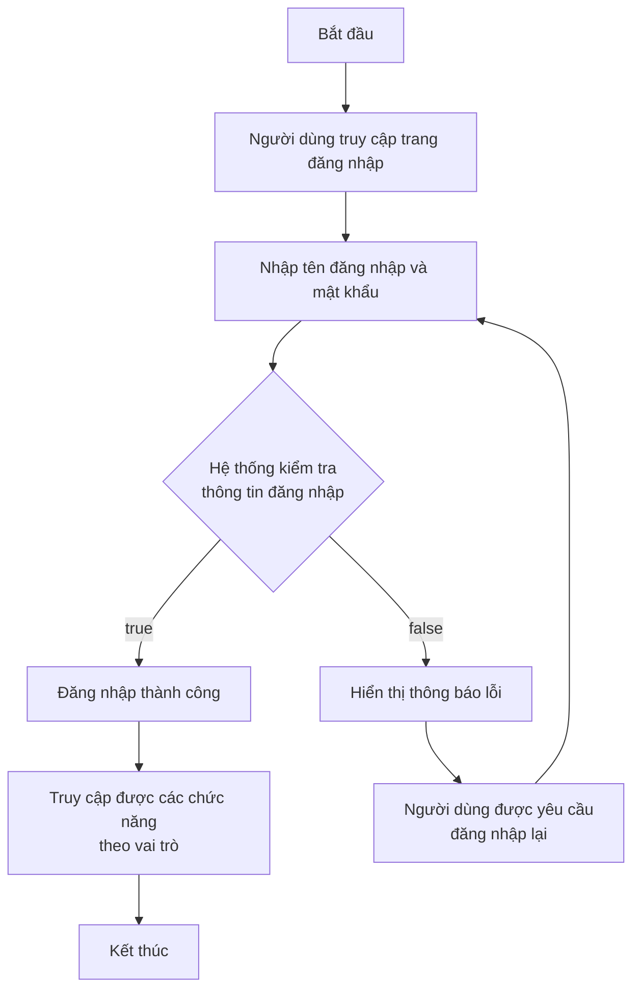

```mermaid
flowchart TD
    A[Bắt đầu] --> B[Người dùng truy cập trang đăng nhập]
    B --> C[Nhập tên đăng nhập và mật khẩu]
    C --> D{Hệ thống kiểm tra\nthông tin đăng nhập}
    D -->|true| E[Đăng nhập thành công]
    D -->|false| F[Hiển thị thông báo lỗi]
    F --> G[Người dùng được yêu cầu\nđăng nhập lại]
    G --> C
    E --> H[Truy cập được các chức năng\ntheo vai trò]
    H --> I[Kết thúc]
```